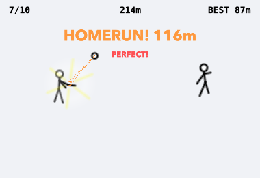
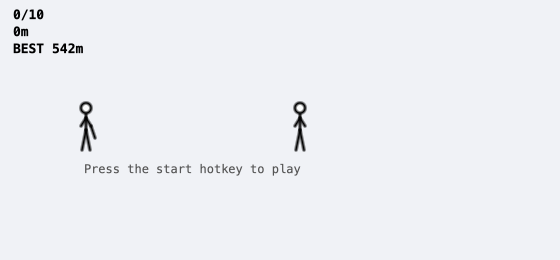

# DeskBat ⚾

**English** | [한국어](README.ko.md)

You are definitely hard at work. There just happens to be a stickman playing
baseball in the corner of your screen.

DeskBat is a tiny overlay game for those moments when you're working on your
Mac and suddenly need to play baseball (it happens more often than you'd
think). It sits quietly in the bottom-left corner of your screen — no Dock
icon, and clicking it never steals focus from the app you're "working" in.
Those 3 minutes waiting for code review, those 5 minutes while the build runs —
your hands never leave the keyboard, so to any onlooker you are simply Very
Busy. Swing with ⌃⌥S, and when someone walks by, destroy the evidence with a
single ⌃⌥H (hides the window and pauses the game; ⌃⌥H again to resume).



*A PERFECT-timing homerun. The rest of the time it waits politely, like below.*



- **Transparent overlay** — borderless, always on top, never steals focus
- **Global hotkeys** — no accessibility permission needed (Carbon RegisterEventHotKey)
- **4 pitch types** — fastball / slowball / curve (drops) / changeup (decelerates)
- **Timing judgment** — homerun, hit, foul, or whiff; better timing = longer distance
- **Hit effects** — impact ring, camera shake, distance-scaled fireworks, fully visible arc
- **Score history** — 10 pitches per game, total distance as score, best-score tracking
- **Boss key** — one key to instantly hide + pause
- **Zero dependencies** — pure Swift + SpriteKit/AppKit, no external assets or libraries

## Install / Build

```sh
sh Scripts/make-app.sh
```

This creates `DeskBat.app` in the repo root. Then run:

```sh
open DeskBat.app
```

To launch at login, add `DeskBat.app` to System Settings > General > Login Items.

## Controls

| Key | Action |
|-----|--------|
| ⌃⌥S (Control+Option+S) | Swing |
| ⌃⌥G (Control+Option+G) | Start a game (10 pitches) |
| ⌃⌥H (Control+Option+H) | Boss key — toggle window visibility (hiding also pauses the game) |
| ⌃⌥R (Control+Option+R) | Toggle the scoreboard panel |

Modifier combos were chosen over F-keys on purpose: many external keyboards
handle `Fn` in firmware and never deliver F6–F8 to macOS at all, and on Mac
laptops the F-row doubles as brightness/volume keys.

Key mappings live in `~/Library/Application Support/DeskBat/config.json`,
auto-created with defaults on first launch:

```json
{
  "swingKeyCode": 1, "swingModifiers": 6144,
  "startKeyCode": 5, "startModifiers": 6144,
  "bossKeyCode": 4, "bossModifiers": 6144,
  "recordKeyCode": 15, "recordModifiers": 6144
}
```

Key codes are macOS virtual key codes (S=1, G=5, H=4, R=15); modifiers are a Carbon
modifier mask (6144 = Control 4096 + Option 2048; Shift 512, Command 256 —
use 0 for a bare key). A config file from an older version without the
modifier fields is automatically reset to these defaults. Restart the app
after changing them.

## Game Rules

A game is 10 pitches. The pitcher throws a random pitch type at random
intervals (1.5–3.5s).

| Pitch | Behavior |
|-------|----------|
| Fastball | Reaches the plate in ~0.45s |
| Slowball | ~0.8s — messes with your timing |
| Curve | Drops vertically |
| Changeup | Decelerates mid-flight |

The result depends on how far the ball is from the contact point at the
moment you swing (converted to ms at the pitch's average speed — so what you
see is what gets judged, even on the decelerating changeup):

- Within ±40ms: **Homerun** (100–150m) — the ball sails far past the pitcher; the more precise, the bigger the fireworks
- Within ±90ms: **Hit** (40–95m)
- Within ±140ms: **Foul** (0m)
- Otherwise, or no swing: **Whiff** (0m)

Your score is the total distance across 10 pitches. Hover over the overlay to
reveal two buttons in the top-right: "History" shows the last 10 games
and your best score, "✕" quits the app.

## Data

Game history is stored at `~/Library/Application Support/DeskBat/history.json`.

## Development

```sh
swift build
swift test
```

The Swift Package has two targets:

- `DeskBatCore` — all game logic (pitch types/trajectories, timing judgment,
  10-pitch session, score/config persistence). A pure Foundation-only library:
  rendering and judgment share the same trajectory function, and randomness is
  injected via RNG for deterministic tests.
- `DeskBat` — the AppKit + SpriteKit executable (overlay window, global
  hotkeys, scene/effects).

The logic lives in Core with a 2-player extension in mind.

## Requirements

macOS 13+; building requires Xcode Command Line Tools (Swift 5.9+).
